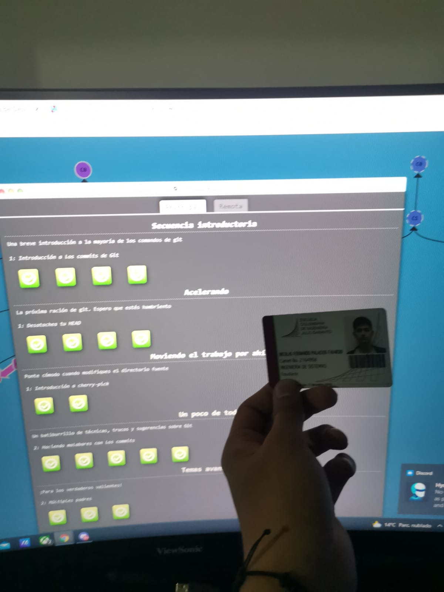
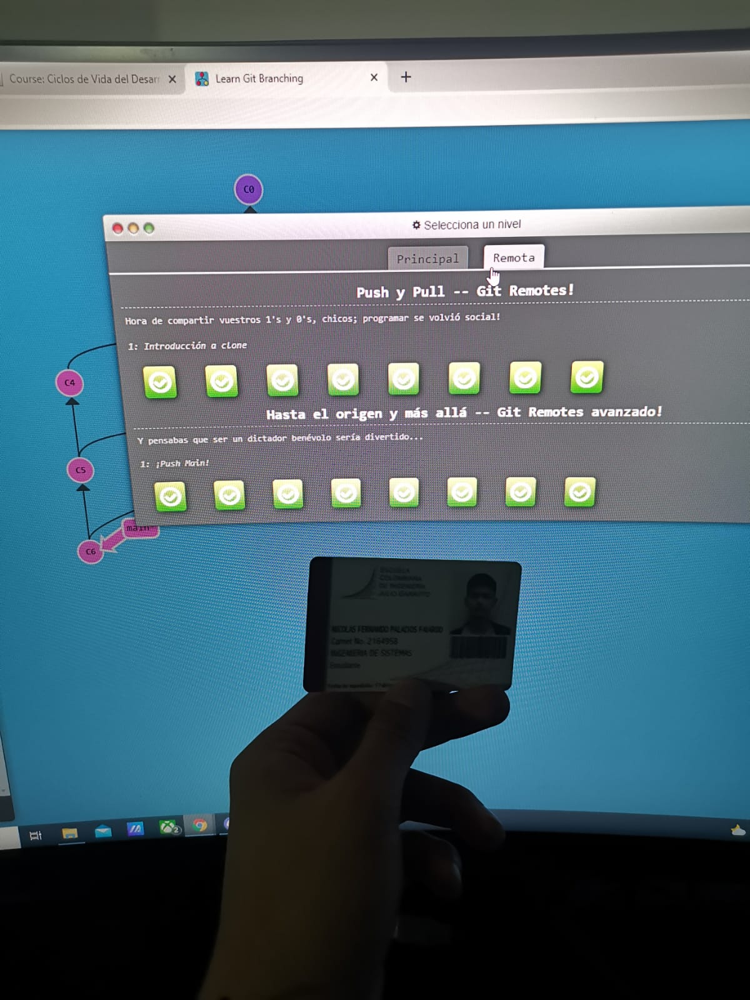

## Informacion Personal
### Nombre
**Nicolas Palacios**  
*9 semestre*  
### gustos  
- comida
- videojuegos
- ciencia  

### enfasis
1. desarrollo  
2. machine learning  
3. redes  

### en la u desde
~~~
print("2019-1")
~~~

[enlace wow]:https://www.linkedin.com/in/nicolas-palacios-5596aa21a/   

  
*descripcion*  
Estudiante de 9 semestre de Ingeniería de Sistemas en la Escuela   Colombiana de Ingeniería Julio Garavito.  

CURSOS Y CONOCIMIENTOS  

- Conocimiento básico de AWS.  
- Conocimiento en base de Datos.  
- Curso de JavaScript.  
- Curso de JavaScript and DataStructures.  
- Seguridad informática.  

   
   
    

